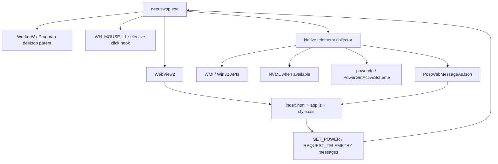

# NexusWpp Architecture

## Runtime

## Startup Path

1. Windows starts `nexuswpp.exe` through the Startup shortcut or the backup scheduled task.
2. A named mutex keeps only one instance alive.
3. WebView2 starts immediately off screen and loads `http://nexuswpp.local/index.html` through a virtual host folder mapping.
4. A 100 ms timer asks Explorer to create the wallpaper layer and searches for `WorkerW`.
5. If `WorkerW` is not ready after 5 seconds, the host temporarily attaches to `Progman` so the wallpaper appears sooner.
6. Once attached, the host covers the virtual screen and keeps listening for display changes.

## Telemetry

Telemetry is collected inside `DesktopHtmlHost.cs`.

- CPU load: `GetSystemTimes`
- CPU temperature: ACPI thermal zone (`MSAcpi_ThermalZoneTemperature`), hidden behind a real fallback metric when the sensor is absent
- CPU frequency: `PercentProcessorPerformance` counter scaled by the base clock
- RAM: `GlobalMemoryStatusEx` plus WMI memory counters; type and module count from SMBIOS
- Disk: WMI logical disk counters
- Network: `NetworkInterface` byte counters plus async ping to `1.1.1.1`
- GPU/iGPU: DirectX LUID registry mapping plus GPU performance counters
- NVIDIA details: NVML when available (temperature, clocks, fan, VRAM); otherwise driver-reported VRAM size and the Windows `DedicatedUsage` counter
- System uptime: `GetTickCount64`
- Power plans: `powercfg /list`, `PowerGetActiveScheme`, and `PowerSetActiveScheme`

The frontend receives telemetry only through WebView2 messages. There is no HTTP server in the current native architecture.

## Interaction

The injected WebView2 window lives below desktop icons, so normal mouse delivery is unreliable. The frontend reports the bounds of the power-plan panel with `BOUNDS:left,top,right,bottom`. The host installs a low-level mouse hook and forwards clicks inside that rectangle to Chromium, then swallows those clicks so Windows does not select desktop icons behind the UI.

## Performance Choices

- WebView2 is warmed before `WorkerW` is found.
- The Canvas loop sleeps when particles/interactions stop.
- Top-process WMI collection is throttled and protected against overlapping calls.
- GPU routing is left to Windows; NexusWpp does not write DirectX GPU preferences.
- Fullscreen app detection suspends telemetry and Canvas work, then resumes immediately when fullscreen clears.
