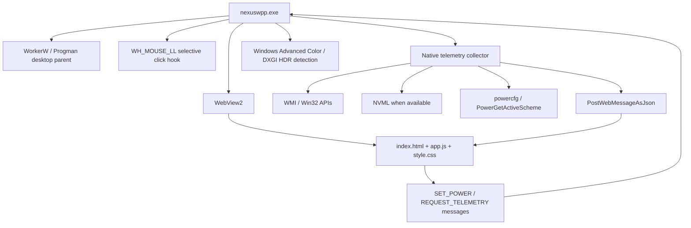

# NexusWpp Architecture

## Runtime

## Startup Path

1. Windows starts `nexuswpp.exe` through the Startup shortcut or the backup scheduled task.
2. A named mutex keeps only one instance alive.
3. WebView2 starts immediately off screen and loads `http://nexuswpp.local/index.html` through a virtual host folder mapping.
4. A 100 ms timer asks Explorer to create the wallpaper layer and searches for `WorkerW`.
5. If `WorkerW` is not ready after 5 seconds, the host temporarily attaches to `Progman` so the wallpaper appears sooner.
6. Once attached, the host covers the virtual screen and keeps listening for display changes.

## Telemetry

Telemetry is collected inside `DesktopHtmlHost.cs`.

- CPU load: `GetSystemTimes`
- RAM: `GlobalMemoryStatusEx` plus WMI memory counters
- Disk: WMI logical disk counters
- Network: `NetworkInterface` byte counters plus async ping to `1.1.1.1`
- GPU/iGPU: DirectX LUID registry mapping plus GPU performance counters
- NVIDIA details: NVML when available
- Power plans: `powercfg /list`, `PowerGetActiveScheme`, and `powercfg /setactive`
- Display/HDR state: Windows Advanced Color plus DXGI probes. This reports OS/display HDR state only; the current WebView2 renderer is still SDR.

The frontend receives telemetry only through WebView2 messages. There is no HTTP server in the current native architecture.

## Interaction

The injected WebView2 window lives below desktop icons, so normal mouse delivery is unreliable. The frontend reports the bounds of the power-plan panel with `BOUNDS:left,top,right,bottom`. The host installs a low-level mouse hook and forwards clicks inside that rectangle to Chromium, then swallows those clicks so Windows does not select desktop icons behind the UI.

## Performance Choices

- WebView2 is warmed before `WorkerW` is found.
- The Canvas loop sleeps when particles/interactions stop.
- Top-process WMI collection is throttled and protected against overlapping calls.
- GPU routing preferences are written in `HKCU\Software\Microsoft\DirectX\UserGpuPreferences`.
- Fullscreen app detection suspends telemetry and Canvas work, then resumes immediately when fullscreen clears.

## HDR Status

The current renderer is WebView2 SDR. The app now detects real Windows HDR state and shows it as `OS HDR ON/OFF`, but it does not claim that the HTML renderer itself outputs HDR.

The DXGI probe in `scripts/hdr_dxgi_probe.cs` verifies whether the active output is in `DXGI_COLOR_SPACE_RGB_FULL_G2084_NONE_P2020`. A true HDR wallpaper requires a native Direct3D/DXGI swap chain and is tracked in `HDR_NATIVE_RENDERER_PLAN.md`.
